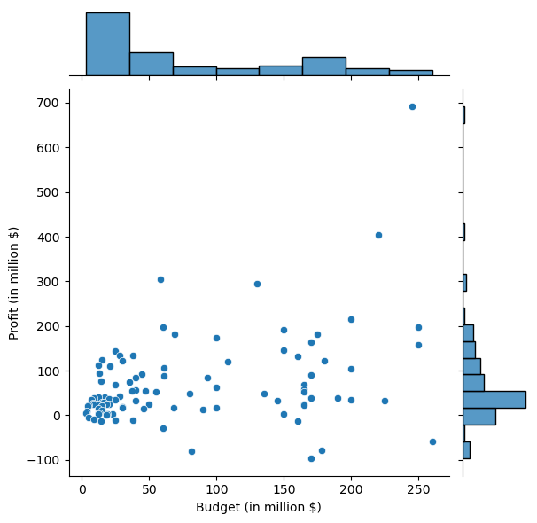
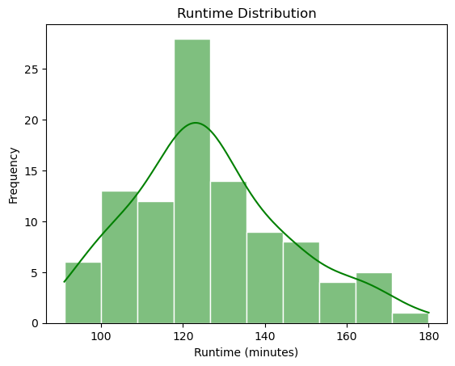
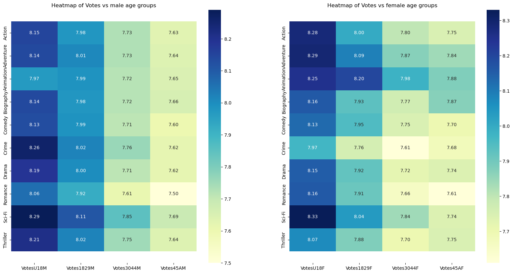

# 🎬 IMDb Top 100 Movies (2010–2020) - Exploratory Data Analysis

This project explores a dataset of the **top 100 IMDb-rated movies from the past decade**, focusing on uncovering insights from movie budgets, gross earnings, genres, and ratings using Python and visualization libraries.

---

## 🎯 Project Goals

This comprehensive analysis aims to uncover hidden patterns and insights from the top 100 IMDb-rated movies (2010-2020) through three main investigative phases:

### 📊 **Phase 1: Data Foundation**
- **Data Loading & Inspection**: Establish a solid foundation by loading and thoroughly examining the dataset
- **Quality Assessment**: Ensure data integrity and identify any structural issues

### 💰 **Phase 2: Business Intelligence**
- **Financial Analysis**: Transform and analyze budget, revenue, and profit metrics
- **Performance Evaluation**: Compare critic vs audience ratings to identify universally acclaimed films
- **Talent Discovery**: Identify the most influential actor combinations and their market impact
- **Content Analysis**: Examine runtime patterns and age-appropriate content consumption

### 👥 **Phase 3: Audience Insights**
- **Genre Preferences**: Understand what different demographics prefer to watch
- **Geographic Trends**: Compare how US and international audiences rate movies
- **Voting Patterns**: Analyze how different age groups and genders engage with various genres
- **Elite Voter Analysis**: Study the preferences of IMDb's top 1000 most active voters

---

## 🧠 Key Insights

**Task 1: Data Exploration**
- 📊 Analyzed 100 top movies with detailed information on ratings, budgets, and votes
- 📈 Converted money values to millions for easier reading
- 🎯 Found clean data with very few missing values

**Task 2: Business & Performance Analysis**
- 💰 Higher budget movies tend to earn more money
- 🎭 Found the most popular actor groups based on social media likes
- ⏱️ Most movies are around 2 hours long
- 🎬 Young viewers surprisingly watch many R-rated movies

**Task 3: Demographic & Audience Analysis**
- 👥 Men and women prefer different movie genres
- 🌍 American movies are popular worldwide
- 🎭 Drama and Adventure are the most liked genres
- 🏆 Serious movie fans prefer Drama over Romance

---

## 📊 Tools & Libraries Used

- `Python`
- `Pandas`
- `Matplotlib`
- `Seaborn`
- `Jupyter Notebook`

---

## 📂 Folder Structure

```
IMDb-EDA-Project/
├── IMDb Dataset EDA.ipynb
├── Movie Data.csv           # or whatever dataset file is named
├── Movie Data Dictionary.xlsx   # data dictionary for the dataset
├── images/                    # plots or EDA screenshots
└── README.md
```

---

## 🖼️ Visual Snapshots

### 📊 Profit vs Budget Analysis


### ⏱️ Movie Runtime Distribution


### 🌡️ Demographic Heatmap Analysis


### 📦 US vs Non-US Movie Preferences


---

## 🚀 How to Run This Notebook

1. Clone the repository
2. Open `IMDb Dataset EDA.ipynb` in Jupyter Notebook
3. Install dependencies (if needed):
   ```bash
   pip install pandas matplotlib seaborn
   ```
4. Run all cells to reproduce the analysis

---

## ✨ Author

**Shresth Tiwari**  
_BTech CSE | Data Science , Machine Learning_  
[LinkedIn](https://www.linkedin.com/in/shresth-tiwari-37b417300)
